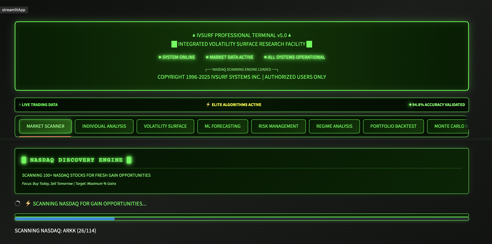

# IVSURF

Quantitative finance research platform for volatility surface analysis, swing signal scoring, and risk analytics. Built as an educational and research tool — not a live trading system.



[](https://ivsurf-volatility-explorer.streamlit.app)

## Live Demo

[https://ivsurf-volatility-explorer.streamlit.app](https://ivsurf-volatility-explorer.streamlit.app)

## What It Does

IVSURF combines classical quant finance with opening-hours volatility scanning in a Streamlit terminal:

- **3D Spatial Lab** — parametric math surfaces, ML loss landscapes, PCA feature space, knowledge graphs, correlation sphere, opening score terrain
- **Opening scanner** — ranks tickers by gap, premarket volume, opening range, and regime-adjusted scores
- **Market scanner** — ranks NASDAQ tickers by rule-based swing opportunity scores
- **Volatility surfaces** — builds and visualizes IV surfaces from Yahoo Finance options chains
- **Quant models** — GARCH, regime switching, Heston MC, VaR, Monte Carlo simulation
- **ML forecasting** — sklearn ensemble + walk-forward XGBoost ranker (TensorFlow LSTM optional)
- **Risk analytics** — VaR, stress testing, regime-aware backtesting
- **REST API** — FastAPI endpoints for scan, predict, signal history, and live opening-range websocket
- **Paper trading** — Alpaca and simulated brokers with pre-trade guardrails

**Data sources:** Yahoo Finance (default). Alpaca optional for 1-min bars and paper trading.

## Quick Start

```bash
git clone https://github.com/DDVHegde100/ivsurf.git
cd ivsurf

python -m venv .venv
source .venv/bin/activate

pip install -r requirements.txt
streamlit run scripts/ivsurf_retro_terminal.py --server.port 8503

# Optional: REST API
pip install -e ".[api]"
uvicorn api.main:app --reload --port 8000
```

### Optional Dependencies

Install extras via `pyproject.toml`:

```bash
pip install -e ".[dev]"        # pytest, ruff
pip install -e ".[ml]"           # TensorFlow for LSTM models
pip install -e ".[quant]"        # arch, statsmodels for clustering diagnostics
pip install -e ".[perf]"         # numba for Monte Carlo acceleration
pip install -e ".[all]"          # everything
```

## Project Structure

```
ivsurf/
├── engine/                  # Business logic (data, features, signals, backtest, execution)
├── api/                     # FastAPI routes
├── app/                     # Streamlit UI components and themes
├── core/                    # Black-Scholes, Greeks, interpolation, GP smoothing
├── models/                  # GARCH, regime switching, Heston, jump diffusion
├── ml/                      # Volatility forecasting, neural networks
├── risk/                    # VaR, stress testing
├── portfolio/               # Regime-aware backtesting
├── simulation/              # Monte Carlo, exotic options, correlation engine
├── indicators/              # Technical analysis indicators
├── visuals/                 # Plotly/matplotlib charting
├── utils/                   # Yahoo Finance data fetcher
├── scripts/
│   └── ivsurf_retro_terminal.py   # Main Streamlit app
├── docs/                    # Architecture and design docs
└── tests/                   # pytest suite
```

## Usage Examples

### Option Pricing

```python
from core.black_scholes import black_scholes_price, implied_volatility
from core.greeks import all_greeks

call_price = black_scholes_price(S=100, K=105, T=0.25, r=0.05, sigma=0.2, option_type='call')
greeks = all_greeks(S=100, K=105, T=0.25, r=0.05, sigma=0.2, option_type='call')
iv = implied_volatility(price=3.50, S=100, K=105, T=0.25, r=0.05, option_type='call')
```

### Volatility Surface

```python
from core.advanced_interpolation import AdvancedSurfaceInterpolator
from visuals.plot_surface import plot_vol_surface_plotly

interpolator = AdvancedSurfaceInterpolator()
smooth_surface = interpolator.interpolate_surface(surface_data, method='gaussian_process')
fig = plot_vol_surface_plotly(smooth_surface)
```

### Risk Analysis

```python
from risk.var_analysis import VaRAnalyzer

var_analyzer = VaRAnalyzer()
var_results = var_analyzer.calculate_portfolio_var(
    portfolio_returns,
    confidence_levels=[0.95, 0.99],
    methods=['historical', 'monte_carlo'],
)
```

## Testing

```bash
pip install -r requirements-dev.txt
pytest                          # unit tests (excludes integration by default)
pytest -m integration           # live market data tests (requires network)
```

## Deployment

Streamlit Community Cloud (recommended):

1. Fork this repository
2. Go to [share.streamlit.io](https://share.streamlit.io/)
3. Set main file: `scripts/ivsurf_retro_terminal.py`
4. Deploy

See [DEPLOYMENT.md](DEPLOYMENT.md) for Streamlit Cloud, FastAPI, and Alpaca setup. See [docs/ARCHITECTURE.md](docs/ARCHITECTURE.md) for system design.

## Known Limitations

- Opening scanner uses **heuristic scoring** with optional ML re-ranking when a trained model is present
- Yahoo Finance data is delayed and may break without notice; Alpaca recommended for intraday bars
- TensorFlow, arch, statsmodels, and numba are optional — features degrade gracefully if missing
- Live order submission requires explicit user confirmation; guardrails are enabled by default
- Not investment advice — research and educational use only

See [CHANGELOG.md](CHANGELOG.md) for release history and [DEPLOYMENT.md](DEPLOYMENT.md) for the v1.0 production checklist.

## License

MIT License — see [LICENSE](LICENSE).

## Disclaimer

This software is for **educational and research purposes only**. Not investment advice. All trading involves substantial risk of loss.

---

**Dhruv Hegde** — Quantitative Developer & Trading Systems Engineer
